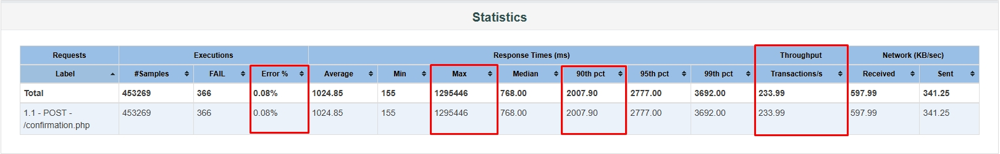
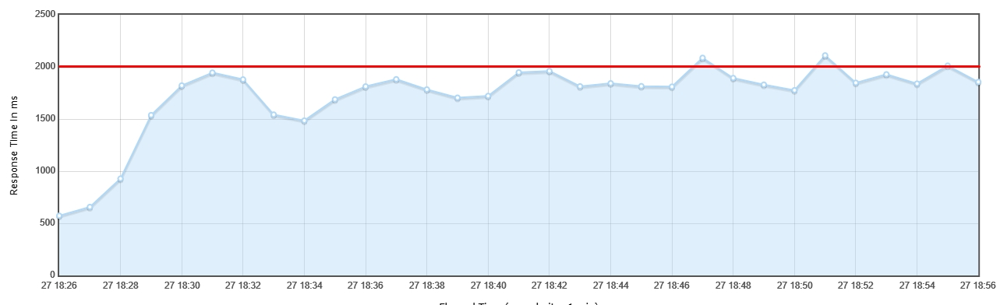
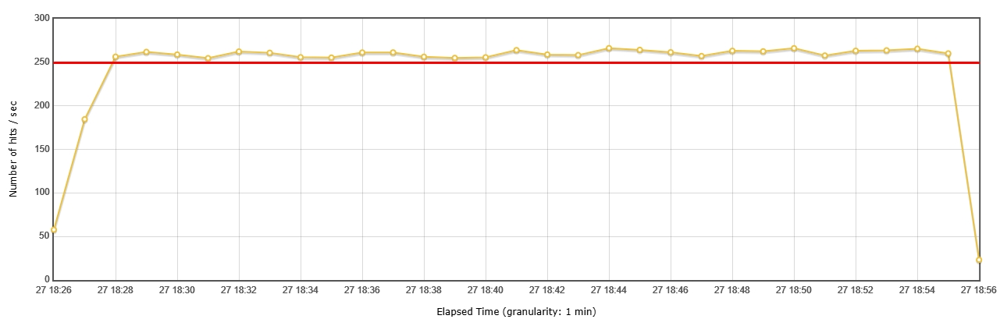
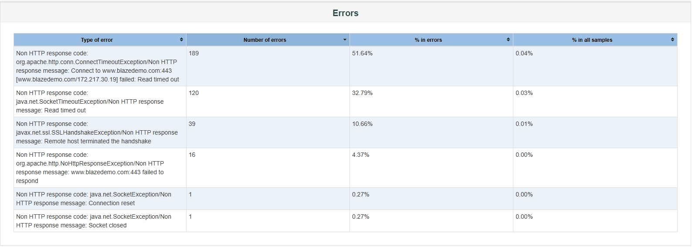
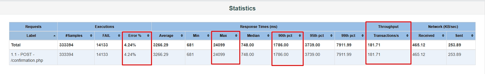
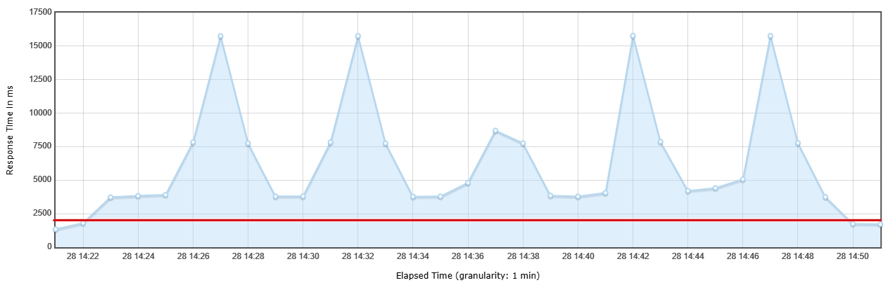
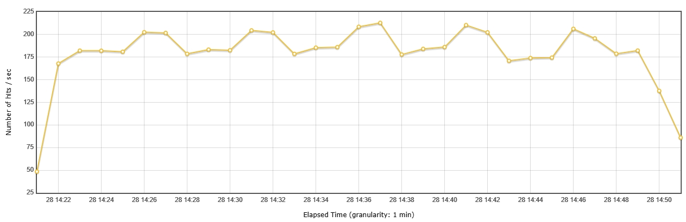
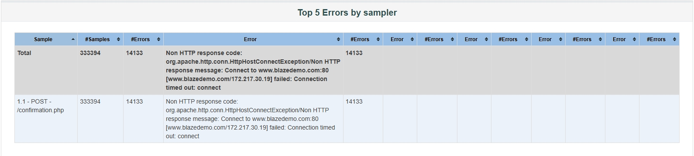

# Tutorial: Executar um Script JMeter no Windows

<details>
<summary><strong>Passo 1: Baixar o JMeter</strong></summary>

1. **Acesse o site oficial do JMeter:**
   - Abra o seu navegador e vá até a página de downloads do Apache JMeter: [Apache JMeter Downloads](https://jmeter.apache.org/download_jmeter.cgi).

2. **Baixe a versão mais recente:**
   - Clique no link do arquivo ZIP para baixar a versão mais recente do JMeter (ex: `apache-jmeter-x.x.zip`).

</details>

<details>
<summary><strong>Passo 2: Instalar o JMeter</strong></summary>

1. **Descompactar o arquivo:**
   - Localize o arquivo ZIP baixado. Clique com o botão direito do mouse e selecione **Extrair Tudo...** para descompactar o arquivo em um diretório de sua escolha (por exemplo, `C:\jmeter`).

2. **Instalar o Java (se necessário):**
   - O JMeter requer Java. Para verificar se o Java está instalado, abra o Prompt de Comando (pressione `Windows + R`, digite `cmd` e pressione Enter) e execute o seguinte comando:

     ```bash
     java -version
     ```

   - Se o Java não estiver instalado, você pode baixar o JDK (Java Development Kit) do [Oracle Java](https://www.oracle.com/java/technologies/javase-jdk11-downloads.html) ou usar uma versão do OpenJDK. Após a instalação, verifique novamente no Prompt de Comando.

</details>

<details>
<summary><strong>Passo 3: Configurar Variáveis de Ambiente (opcional)</strong></summary>

1. **Adicionar à variável PATH:**
   - Clique com o botão direito do mouse no ícone do **Windows** e selecione **Sistema**.
   - Clique em **Configurações avançadas do sistema** no painel esquerdo.
   - Na aba **Avançado**, clique no botão **Variáveis de Ambiente**.
   - Na seção **Variáveis do sistema**, localize a variável chamada `Path`, selecione-a e clique em **Editar**.
   - Clique em **Novo** e adicione o caminho do diretório `bin` do JMeter (por exemplo, `C:\jmeter\apache-jmeter-x.x\bin`).
   - Clique em **OK** para fechar todas as janelas.

</details>

<details>
<summary><strong>Passo 4: Executar o JMeter</strong></summary>

1. **Abrir o JMeter:**
   - Navegue até o diretório `bin` do JMeter (ex: `C:\jmeter\apache-jmeter-x.x\bin`) e localize o arquivo `jmeter.bat`.
   - Clique duas vezes no `jmeter.bat` para abrir a interface gráfica do JMeter.

</details>

<details>
<summary><strong>Passo 5: Importar o Script Existente</strong></summary>

1. **Carregar o script JMeter:**
   - Na interface gráfica do JMeter, vá para `File > Open...` e selecione o arquivo `.jmx` do seu script existente.

</details>

<details>
<summary><strong>Passo 6: Executar o Script</strong></summary>

1. **Configurar a execução:**
   - Após abrir o script, revise as configurações de ambiente e variáveis, conforme necessário. Verifique se todas as dependências e configurações do seu script estão corretas.

2. **Executar o teste:**
   - Clique no botão de **Iniciar** (ícone de play) na barra de ferramentas ou pressione `Ctrl + R` para iniciar a execução do script.

</details>

<details>
<summary><strong>Passo 7: Analisar os Resultados</strong></summary>

1. **Ver os resultados:**
   - Os resultados da execução serão exibidos nos listeners que você adicionou ao seu teste. Você pode adicionar ouvintes como **View Results Tree** ou **Summary Report** para visualizar os dados de forma mais clara.

</details>

# Relatório de Teste de Performance 28/09/2024

Este documento descreve os resultados dos testes de performance realizados para avaliar o desempenho da funcionalidade de compra de passagens aplicação <a href="https://www.blazedemo.com/">blazedemo</a>.

## Ferramentas Utilizadas
- **Ferramenta de teste**: JMeter
- **Ambiente de teste**: Produção
  - **Sistema Operacional**: Windows 11
  - **CPU**: Intel Core i5 11600K 3.91 GHz
  - **Memória RAM**: 32GB
  - **Rede**: 500Mbps
  
## Metodologia de Teste
- **Cenários testados**:
  - SMOKE: Teste realizado com 5 VUs em no periodo de 5 minutos com o objetivo de determinar um plano de teste que fizesse sentido com os critérios de aceite passados pelo solicitante. (Não foi levado em consideração para extração de métricas)
  - LOAD: Teste realizado com 280 VUs no periodo de 30 minutos com rampa de 4 minutos.
  - SPIKE: Teste realizado com 400 VUs no periodo de 30 minutos com rampa de 3 minutos e picos de 1300 VUs mantendo-se por 1 minuto.
  
  - Observações: Em ambos os testes (LOAD e SPIKE) oque foi levado em consideração para a construção do plano de teste foi a vazão, já que foi o ponto critico menciona pelo solicitante.

  - Ponto de atenção: Não foi possivel ter acesso a nenhum APM para validações de uso de infraestrutura, banco de dados e traces das chamadas e suas integrações já que a solicitação em questão se trata de um cenário fictício.
  
## Resultados

## LOAD Test:
- **Total de Requisições**: `453.269`
- **Requisições por segundo (RPS Estatisticas)**: `234`
- **Requisições por segundo (RPS Gráfico)**: `256-266`
- **Tempo de Resposta 90pct**: `2 segundos (2007ms)`
- **Porcentagem de Erros**: `0.08`

### Estatísticas e Gráficos LOAD Test

Estatísticas:

Esta imagem representa as estatisticas de Tempos de Respostas (90pct e Máxima), Vazão e Erros sumarizados.

Aqui podemos observar que a porcentem de erros foi baixa, o tempo de resposta máximo de uma requisição foi de 21 minutos oque impactou diretamente no resultado final de vazão, o tempo de resposta considerando o percentil 90 foi de 2 segundos porém a vazão ficou em 234rps.

Tempo de Resposta (90pct):

Esta imagem representa o gráfico de tempo de resposta (90pct) em tempo real.

Neste gráfico podemos observar que o tempo de resposta considerando o percentil 90 ficou abaixo do máximo esperado (2 segundos) durante quase toda a execução do teste. A aplicação demonstra uma boa capacidade de tempo de resposta com carga continua.

Vazão:

Esta imagem representa o gráfico de vazão em tempo real.

Neste gráfico podemos observar que vazão ficou acima do esperado (250rps) durante toda a execução do teste.

Erros:

Esta imagem representa as porcentagens de Erros sumarizados.

Todos os erros são relacionados a Connection Closed, Timeouts e Connection Reset.


## SPIKE Test:
- **Total de Requisições**: `333.394`
- **Requisições por segundo (RPS Estatisticas)**: `182`
- **Requisições por segundo (RPS Gráfico)**: `182-212`
- **Tempo de Resposta 90pct**: `1.7 segundos (1786ms)`
- **Porcentagem de Erros**: `4.24`

### Estatísticas e Gráficos SPIKE Test

Estatísticas:

Esta imagem representa as estatisticas de Tempos de Respostas (90pct e Máxima), Vazão e Erros sumarizados.

Aqui podemos observar que a porcentem de erros foi baixa, o tempo de resposta máximo foi de 24 segundos e o tempo de resposta considerando o percentil 90 foi de 1.7 segundos porém a vazão ficou em 182rps.

Tempo de Resposta (90pct):

Esta imagem representa o gráfico de tempo de resposta (90pct) em tempo real.

Neste gráfico podemos observar que o tempo de resposta considerando o percentil 90 ficou acima do máximo esperado (2 segundos) durante toda a execução do teste e principalmente nos momentos de pico. A aplicação não demonstra uma escalabilidade rápida levando em conta o aumentos de requisições repentinas.

Vazão:

Esta imagem representa o gráfico de vazão em tempo real.

Neste gráfico podemos observar que a vazão ficou abaixo do esperado (250rps) durante toda a execução do teste. Isso demonstra que a aplicação não se recupera após exposta a picos de requisições.

Erros:

Esta imagem representa as porcentagens de Erros sumarizados.

Todos os erros são relacionados a Timeouts.


## Conclusões
- O sistema apresentou boa escalabilidade com o aumento do número de requisições.
- Identificamos uma pequena degradação de performance a partir de 300 requisições simultâneas levando em consideração o critério de aceite de tempo de resposta.
- Não foram Identifidos erros significativos no LOAD Test.
- A aplicação apresentou mais erros no teste de PICO, mesmo assim pela carga aplicada não foram considerados expressivos.

## Recomendações
- Fornecer monitoramentos de infraestrutura, aplicação e banco de dados para melhor analise e calculo de um plano de teste voltado para a realidade de acessos simultâneos da aplicação.
- Após o fornecimento dos monitoramentos, indicamos uma nova rodada de testes para garantir a integridade da aplicação no ambiente de produção.

